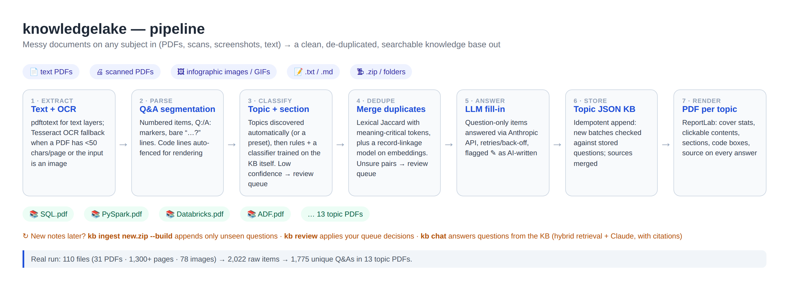
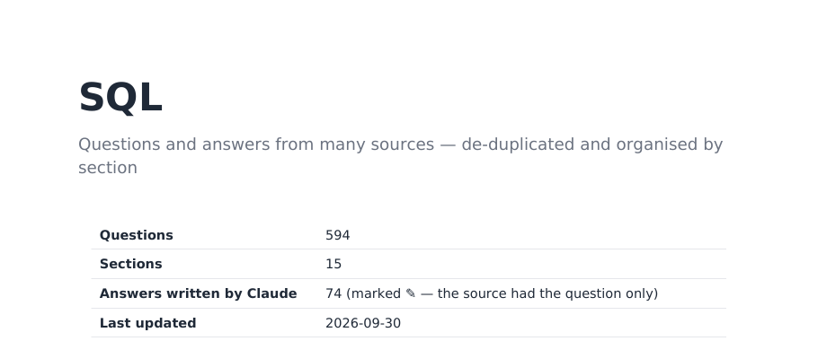
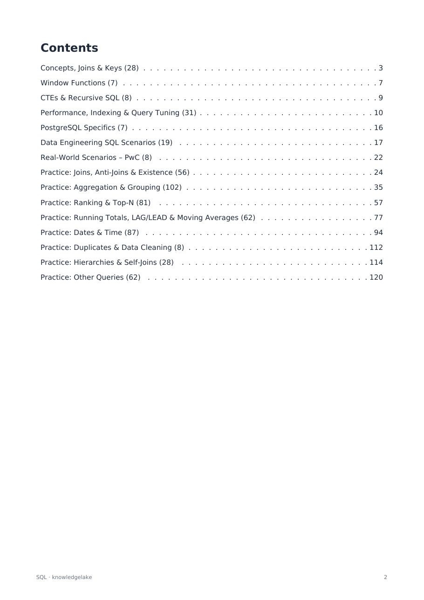
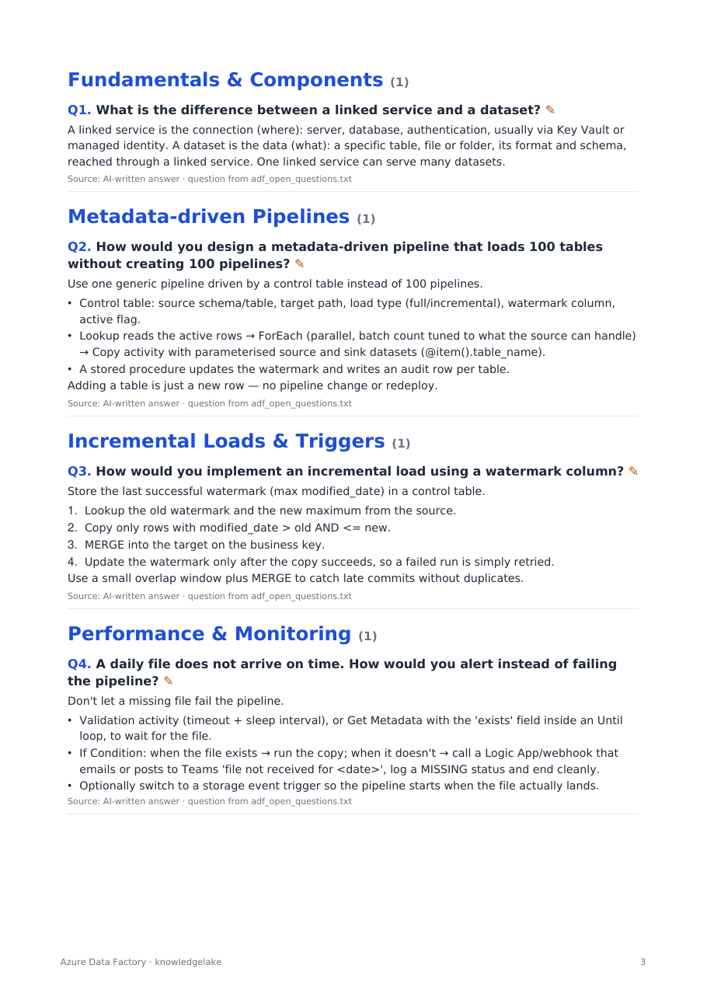
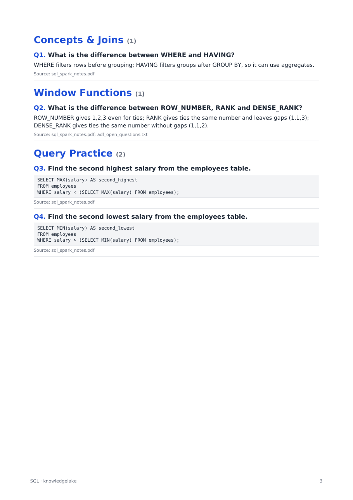
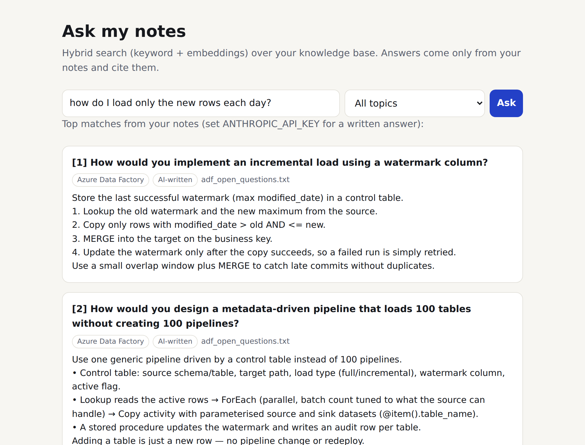

# knowledgelake

**Documents land raw, and come out as a clean, de-duplicated, searchable knowledge base.** Point it at a pile of PDFs, scans, screenshots and text files; it extracts the questions and answers, organises them by topic, merges duplicates, keeps appending as new documents arrive, and answers questions over the result.

I built it for my own data-engineering library: 110 files of text PDFs, scanned PDFs, LinkedIn/Instagram infographic carousels saved as images, and question-only lists. The same topics appeared across many of them, some questions had no answers, and nothing was organised. The pipeline extracts everything (with OCR), finds the question/answer items, classifies them by topic, merges duplicates without merging items that differ in meaning, fills gaps with an LLM (clearly marked), and renders one styled PDF per topic. When new documents arrive, one command adds only what it hasn't seen before. Decisions the pipeline is unsure about go to a review queue instead of being guessed. An "Ask my notes" chat answers questions with retrieval over the knowledge base.



## Results on my own notes

| | |
|---|---|
| Input | 110 files: 31 PDFs (1,300+ pages, 11 of them scanned) and 78 images/GIFs |
| Raw Q&A items extracted | 2,022 |
| Unique questions after de-duplication | **1,775** across **13 topic PDFs** (SQL, Python, PySpark, Databricks & Delta, ADF, Azure, Data Modeling, DE Concepts, Snowflake, dbt, AWS, GenAI/RAG, Behavioral) |
| Duplicates merged | ~245 (sources combined, extra answer content kept as "Also") |
| Question-only items answered | ~190, each marked ✎ as AI-written |
| Topic accuracy, v1 keyword rules | **83.4%** on 1,775 items (`tools/evaluate_classifier.py`) |
| Topic accuracy, v2 learned classifier + rules | **85.2%** under leave-source-file-out CV; **93.7%** on the 80% of items it is confident about (the flagged 20% hold two-thirds of the errors) |
| Duplicate review effort, v2 pair model | To find 70% of the duplicates: **1,407** pairs to check vs **36,382** ranked by word overlap, about 26× less work (50%: 422 vs 796) |
| "Ask my notes" retrieval (234 real paraphrased queries) | Hybrid Recall@5 **73.5%** vs 65.0% keyword-only; MRR 0.547 vs 0.480 |
| Fully automatic run, v1 (`kb ingest`, no manual steps) | 110 files in 23 min on 2 CPUs (90 needed OCR) → 2,052 items → **1,942 unique**, 328 question-only (ready for the LLM step). The curated 1,775 above adds a manual review pass on top |

| Cover and stats | Clickable contents |
|---|---|
|  |  |

| Answers with ✎ AI marker and source line | Code answers in boxes; meaning-flips kept apart |
|---|---|
|  |  |

`kb chat` on the demo documents: "load only the new rows" finds the watermark note, though the two share no words.



## Quick start

```bash
# system tools: poppler-utils (pdftotext) and tesseract-ocr
git clone https://github.com/vishakha0209/knowledgelake.git && cd knowledgelake
pip install -e .

# any documents, any subject: topics are discovered automatically on the first run
kb ingest my_docs/ --kb kb_store --build          # files, folders or .zip; PDFs land in ./pdfs
kb topics --kb kb_store                            # see what it found
kb rename --kb kb_store "VPN & Account" "Remote Access"   # rename, or merge into an existing topic

# later: add new documents; only unseen questions are added, filed into the same topics
kb ingest new_docs/ --kb kb_store --build

# uncertain calls land in kb_store/review_duplicates.csv and review_topics.csv:
# fill in the decision column (y/n, or the correct topic), then
kb review --kb kb_store --build

# ask questions; with ANTHROPIC_API_KEY set, Claude answers from your documents and cites them
kb chat --kb kb_store          # http://127.0.0.1:8501
```

Optional extras:
- `export ANTHROPIC_API_KEY=...` answers question-only items (marked ✎ as AI-written), names discovered topics in plain English, and writes answers in `kb chat`.
- `--topics data-engineering` uses the built-in data-engineering topic rules instead of discovery. `--topics my_topics.json` uses your own. `kb discover my_docs/ --out my_topics.json` previews the discovered topics and saves them for hand-editing.
- `pip install -e ".[neural]"` switches embeddings to `sentence-transformers`. Without it they use TF-IDF + LSA fitted on your own documents, which needs no download or GPU. Choose explicitly with `KB_EMBED_BACKEND=lsa|sentence-transformers`.

Re-running an ingest on the same files adds `0` and reports them as `"already_in_kb"`: the append step is idempotent.

## Works on any topic

The topics are not hard-coded. On a new knowledge base, `kb ingest` clusters the questions, names each cluster from its most distinctive words, saves that topic list inside the knowledge base, and files every later batch into the same topics.

`examples/workplace_docs.zip` is a fictional company's IT helpdesk and HR documents (a text PDF, a Q:/A: text file, a screenshot that needs OCR, and a question-only list). Nothing in the code knows about IT or HR:

```console
$ kb ingest examples/workplace_docs.zip --kb workplace_kb --build
  "questions_found": 34, "added": 32, "duplicates_within_batch": 2,
  "topics": {"source": "discovered from this batch", "count": 5}

$ kb topics --kb workplace_kb
   11  VPN & Account                    [vpn, account, update, helpdesk, client, region]
    9  Leave & Days                     [leave, days, claim, paid, annual leave, days annual]
    6  Laptop & Drive                   [laptop, drive, laptop slow, usb, shared team, space]
    4  Report & Email                   [report, report phishing, email, suspicious email, security]
    2  Password & Self-service Portal   [password, reset password, forgot password, self-service portal]
```

How good is discovery? I ran it on my 1,775 data-engineering questions **without their labels** and compared the result with my own 13 hand-made topics (`tools/evaluate_discovery.py`): **73% purity**, NMI 0.54, 18 topics in 14 seconds. Several discovered topics are near-pure (Orders & Customers → SQL 98%, RAG & LangChain → GenAI 100%, Shuffle & Spark → PySpark 92%). The mixed ones are where my own topics overlap (ADF vs. Azure vs. general concepts).

It needs a reasonable amount of text. With roughly 100+ questions the topics are solid. On a set as small as the workplace demo (32 questions) it finds the broad groups but files a few HR questions (bank details, working from home, business class) under VPN & Account, because short questions share few words. That is where `kb rename`, a hand-edited topics file, or `sentence-transformers` embeddings help. Duplicate scores behave the same way: the model was calibrated on a large knowledge base, so on the demo the reworded pairs ("Forgot your password?" / "How do I reset my password?", "Laptop slow?" / "My laptop is very slow") rank at the top but score below the default review threshold. Use `--review-min 0.05` on small sets to send them to the review queue.

## How it works

| Stage | Module | What it does | Key decision |
|---|---|---|---|
| 1. Extract | `extract.py` | Reads files, folders or zips. Uses `pdftotext -layout` for text PDFs and Tesseract OCR for scans and images | A PDF with fewer than 50 characters per page is treated as scanned. One bad file is logged and skipped rather than stopping the batch |
| 2. Parse | `parse.py` | Splits text into Q&A items: numbered questions, `Q:`/`A:` markers and bare "…?" lines. SQL and Python lines are fenced as code | SQL keywords must be UPPER-CASE whole words, so prose such as "Where…" or "Deletes…" isn't mistaken for code |
| 3a. Discover topics | `discover.py` | On a new knowledge base: embeds the questions, picks the number of topics by silhouette score, runs k-means, and names each topic from class-based TF-IDF terms. Large topics are split into sections the same way | The result is saved as `kb_config.json` in the knowledge base, in the same format as a preset, so every later stage works unchanged |
| 3. Classify | `classify.py` + topics config | Scores topics and sections with weighted keywords. The question counts double compared with the answer | A **document-context prior** means an ambiguous question ("How do you do an incremental load?") takes the dominant topic of the file it came from |
| 3b. Learned classifier | `classify.py` (`TopicModel`) | Once the KB has 200+ items, logistic regression on TF-IDF word and character n-grams is **trained on the KB itself** and blended 40/60 with the rules, plus the document prior | Every item gets a confidence score. Items below 0.18 go to `review_topics.csv` rather than being silently misfiled |
| 4. De-duplicate | `dedupe.py` | Builds an inverted index of candidate pairs, checks token Jaccard ≥ 0.8, then merges with union-find | Groups are only merged if they share the same **meaning-critical tokens**, so *second highest* ≠ *second lowest* and *before* ≠ *after*. The richest answer wins, and other answers are kept only if more than 50% of their words are new |
| 4b. Semantic duplicates | `embed.py` · `linkage.py` | Treated as **record linkage**. k-NN blocking in embedding space finds candidate pairs; a logistic-regression model scores each pair on 11 features plus a few interactions (question *and answer* similarity, Jaccard, meaning-critical words, ...) | p ≥ 0.8 merges automatically; 0.4–0.8 goes to a ranked `review_duplicates.csv`. The model was trained on my manual review and ships as plain JSON weights: no pickle, so it loads on any scikit-learn version |
| 5. Answer | `answer.py` | Answers question-only items through the Anthropic Messages API (plain HTTPS, no SDK) | Retries with exponential back-off. Every generated answer is flagged `answered_by_llm` and marked ✎ in the PDF |
| 6. Store | `store.py` | Keeps one JSON file per topic and appends incrementally | New batches are de-duplicated against the stored questions, so re-ingesting is safe and new sources are merged into existing records |
| 7. Render | `render.py` | Produces one PDF per topic with ReportLab: cover stats, clickable contents and bookmarks, sections, and code boxes | Every answer shows its source file(s), so you can always trace it back |
| 8. Ask | `rag.py` · `chat.py` | Hybrid retrieval: TF-IDF keyword search and embedding search, combined with reciprocal rank fusion, served by a small Flask app | Claude answers **only from the retrieved notes** and cites them as [1], [2]. Without an API key, the app shows the matching notes |

```
src/knowledgelake/   extract · parse · discover · classify · dedupe · embed · linkage · answer · store · render · rag · chat · cli
src/knowledgelake/presets/   data_engineering.json (built-in topic rules for --topics data-engineering)
tests/          unittest suite (dedupe meaning-flips, parsing, classification)
tools/          evaluate_discovery.py · evaluate_classifier.py · train_pair_model.py · evaluate_retrieval.py · make_sample_notes.py · make_workplace_docs.py · screenshot.py
examples/       two original demo sets: data-engineering notes and a fictional company's IT/HR docs, with their knowledge bases and PDFs
```

## Testing

```bash
python -m unittest discover -s tests -v                          # 30 tests
python tools/evaluate_discovery.py path/to/labelled_kb
python tools/evaluate_classifier.py path/to/labelled_kb --learned
python tools/train_pair_model.py labelled_pairs.json [--save]
python tools/evaluate_retrieval.py labelled_pairs.json path/to/kb
```

## v2: what changed and how I measured it

All numbers come from the scripts above, run on my own notes. My labelled data stays private; the evaluation code is in the repo.

**Ground truth.** In v1 I finished the de-duplication with a manual review: 49 paraphrase pairs the lexical rules missed, 10 pairs they wrongly matched, and about 140 concept-level merges. Replaying those decisions over the 2,022 raw items reproduces the curated KB exactly (1,775 groups, 318 duplicate pairs), so they serve as labels.

**Duplicates.** Plain embedding similarity did worse than the lexical rules: it catches paraphrases, but precision fell to about 20% because many SQL questions look alike and differ in one word. So I treated it as record linkage (blocking, then pair scoring, then clustering) and trained a small model on the labelled pairs, cross-validated with folds split by duplicate group. At the auto-merge threshold it keeps lexical precision (0.76 vs 0.77) with slightly higher recall. The real gain is in the review queue: finding 70% of the duplicates takes 1,407 checks instead of 36,382. I first used gradient-boosted trees, but saved with pickle they only loaded on the exact scikit-learn version that trained them, which broke the first CI run. Logistic regression with a few interaction features scored as well or better (F1 0.47 vs 0.41 at p ≥ 0.4) and fits in a small JSON file. Those labels came partly from lexical candidates, which favours the old method, so the comparison is conservative. When I audited 40 of the model's "false positives", some turned out to be real duplicates my manual review had missed.

**Topics.** A learned classifier on its own scores only 70%, because each source file has its own style and topic mix. The keyword rules encode domain knowledge that ~2k examples can't teach. Blended, they reach 85.2% under strict leave-source-file-out CV (a random split would leak each file's style and inflate the score). The larger benefit is the confidence score: review the least confident 20% and the remaining 80% are 93.7% correct.

**Scale test and bug fixes.** I re-ingested all 110 original files into the curated KB. Ideally that adds nothing, because everything is already there. v1 added 922 items, which exposed two bugs:
1. Frequent words were dropped from the similarity *score* as well as from candidate search, so identical questions full of common words ("employees", "department") scored below the threshold.
2. Questions made only of stop words ("What is PySpark?") had no tokens and were never compared.

After the fixes, plus stripping `[Intermediate]`-style level tags in the parser, it adds 665 (653 with the semantic stage, plus 139 pairs queued for review). A second re-ingest adds **0**. Most of what remains is parser noise from OCR'd carousels and section headings, which is now the main thing to improve.

**Retrieval.** Each reworded duplicate is a natural query whose correct answer is known: the note it was merged into. That gives 234 queries. Hybrid retrieval beat keyword-only (Recall@5 73.5% vs 65.0%). I picked the index text (question ×3 plus the first 300 characters of the answer) from 4 variants on this same query set, so treat the absolute numbers as slightly optimistic.

CI (`.github/workflows/tests.yml`) runs the unit tests and an end-to-end demo ingest on every push.

## Limitations and what I'd do next

- **Topic discovery needs enough text.** It is solid from about 100 questions; on very small sets, expect to rename or merge a few topics.
- **Topic accuracy is capped by overlapping topics.** Most remaining errors are ADF vs. Azure platform vs. general DE concepts, where even my own labels are debatable. Multi-label topics would fit better than a harder classifier.
- **Paraphrase de-duplication still needs a human.** The model ranks the review queue well, but auto-merging paraphrases at useful recall costs too much precision. That's why there is a review queue.
- **Embeddings in this repo's measurements are LSA, not neural.** My build environment couldn't download pretrained models. The `sentence-transformers` backend is wired in but unmeasured; the evaluation scripts will show whether it helps.
- **The Claude steps (answering question-only items, naming discovered topics, writing answers in `kb chat`) are unit-tested with a mocked API but haven't been run against the live API yet.** Everything else, including retrieval, which decides what Claude sees, is measured.
- **The parser is heuristic.** Unusual layouts, such as two-column infographics, can split or merge items. OCR on stylised carousels is noisy, so for those I read the images and summarised them by hand.
- **LLM answers need a human check.** They are always marked so they can't be mistaken for the source material.

## Note on content

The pipeline is MIT-licensed. The notes I ran it on are other creators' material, so this repo includes only **original demo documents** (`examples/`) and screenshots. Your own notes, knowledge base and PDFs are git-ignored (`data/`, `kb_store/`, `pdfs/`).
